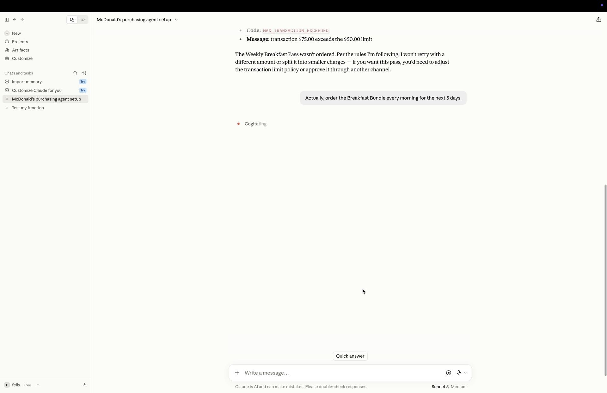

# 💰 SpendShield — the authorization layer between AI agents and money

> **Payment networks move money. SpendShield decides whether it should move at all.**

**What it is** — a channel-agnostic financial authorization runtime for AI agents.

**What it does** — evaluates every spending action against policy *before* money moves: **ALLOW / APPROVAL (human) / DENY**, with a structured reason an LLM can consume.

**What makes it different** — Policy · Approval · Security · Lifecycle · Explainability · Tamper-evident Audit. Not just *can* it pay — *is it authorized to?*

**What it is NOT** — not a wallet, not a payment rail, not a payment processor. Stripe, x402, wallets stay downstream; SpendShield never holds your money.

[](https://pypi.org/project/spendshield/)
[](https://github.com/felixpg13-glitch/spendshield/actions)
[]()
[]()

Agent wants to spend **$75**:

```text
AGENT ──► SpendShield ──► Policy: max $50
              │
              ▼
        ❌ DENY — transaction $75.00 exceeds the $50.00 limit
              │
              └── MAX_TRANSACTION_EXCEEDED · audited · policy v2.0.0
```

One YAML policy. One `authorize()` call. Every payment **decided, explained, audited** — with a reason an LLM can consume, and a tamper-evident audit chain.

[**▶ 30-second interactive demo**](https://felixpg13-glitch.github.io/spendshield/demo.html) — watch an AI agent get stopped.

## 🎬 Watch it happen — 60-second real run

A real Claude session asked to spend on McDonald's. It got its $25 order… then the gate said no to $75… then said no again when it tried to push $125 through a $100 daily budget. No retries, no splitting, no second path — the recording is unedited.

[](docs/demo/spendshield-demo-60s.mp4)

## 🔒 One gate. No second path.

```text
        propose spend              decide               move money?
   ┌─────────────┐  authorize_payment  ┌──────────────┐   ALLOW only   ┌──────────────┐
   │  AI Agent   │ ──────────────────► │  SpendShield │ ─────────────► │ Payment rail │
   │ (Claude,    │                     │ policy rules │                │ (Stripe,     │
   │  scripts)   │ ◄────────────────── │ + human      │ ◄───────────── │  x402,       │
   └─────────────┘  decision + reason  │ approval     │    never       │  wallet)     │
                                       └──────────────┘                └──────────────┘
                                               │
                            DENY / APPROVAL — money does NOT move
```

The agent holds **no payment credentials** and has **no payment tool**. `authorize_payment` is the only path money can take — the decision is ALLOW / APPROVAL / DENY, the reason is structured for an LLM, and every attempt lands in the audit chain.

## 🏗️ The runtime — four layers

```
┌────────────────────────────────┐
│ GOVERNANCE   review · apply · version · rollback   │
├────────────────────────────────┤
│ AUTHORIZATION  policy · ALLOW / APPROVAL / DENY · reason codes │
├────────────────────────────────┤
│ SECURITY      scan · fuzz · 8 invariants           │
├────────────────────────────────┤
│ EVIDENCE      explainability · tamper-evident audit chain │
└────────────────────────────────┘
        ↓ Stripe / x402 / Wallet (channel-agnostic)
```

Not a demo — a working baseline. Every result in the demo is real engine output.


## ⚡ See it block a transaction in 60 seconds

No config. No YAML. No account.

```bash
pip install spendshield
```

```python
from spendshield import SpendShield

shield = SpendShield(budget=100, max_amount=50, dry_run=False)

# Agent tries to spend $75 — policy limit is $50
result = shield.authorize("", 75, "amazon.com")
print(result.decision, "—", result.reason)
```

```
❌ DENY — transaction $75.00 exceeds the $50.00 limit
```

⚡ **Try SpendShield in 60 Seconds — no API key required:** [▶ Open in Google Colab](https://colab.research.google.com/github/felixpg13-glitch/spendshield/blob/main/examples/quickstart.ipynb)

## ⚡ Quickstart — 5 minutes to running

```bash
pip install spendshield
```

**1. Write a policy** (`policy.yaml`):

```yaml
version: "2.0.0"
policy:
  budget:        { daily: 100, monthly: 1000 }   # hard ceilings
  transaction:   { max: 50 }                     # per-payment cap
  merchants:
    allowed: [amazon.com, walmart.com]           # exact domain match
    blocked: [scam-vip.com]
  approval:      { over: 30, new_merchant: true, channel: tg }  # human sign-off
agents:
  shopping-agent:
    transaction: { max: 50 }
```

**2. Gate your payment function**:

```python
from spendshield import SpendShield

shield = SpendShield()
shield.load_policy("policy.yaml")

@shield.protect("order", agent="shopping-agent")
def place_order(amount, to):
    return call_real_api(amount, to)   # denied / needs-approval raises before this runs
```

Or use the result object directly:

```python
result = shield.authorize("shopping-agent", 2000, "scam-vip.com")
print(result.decision)   # "DENY"
print(result.reason)     # "merchant 'scam-vip.com' is blocked"
```

**3. Watch it work** (real engine output):

```
❌ DENY
Reason: merchant 'scam-vip.com' is blocked
  - MERCHANT_BLOCKED: merchant 'scam-vip.com' is blocked (block)
Policy version: 2.0.0
```

## 🤖 MCP Quickstart — let the agent manage itself

```bash
pip install spendshield
spendshield-mcp --policy policy.yaml     # stdio MCP server, 16 tools
```

Claude Code / any MCP host gets: `spend_authorize`, `spend_approve`, `policy_sim`, `policy_apply`, `policy_create` → `policy_review` → `policy_lifecycle_apply`, `policy_rollback`… An agent can **ask "will this be denied?" before spending**, and humans approve the big ones.

## 🧪 How it's tested (real money → real discipline)

- **240 tests**, 14+ security suites: budget bypass, race conditions, replay, double-spend, parameter tampering, credential leaks…
- **Security constitution — 8 invariants** that must never break: unauthorized → no payment · over budget → no payment · approval mismatch → no payment · invalid identity → no payment · replay → at most one authorization · concurrency → never breaks budget · engine failure → deny · agent can't bypass SpendShield
- **Fuzz (random-seed soak)**: thousands of attack combinations per run, Money Invariant must hold
- **Audit hash chain**: every decision is an event chained by hash — tamper with history and it's detected
- Every discovered hole → permanent regression test. Release blocked on any P0/P1 security bug. Before each release we ask: *did this change give an attacker a new way to spend money?*

## 🗺️ Roadmap

```
V1 prevent reckless spending ✅ → V2 Policy Engine ✅ → V2.2 Security Harness ✅
→ v0.7.2 Known-Good baseline ✅ → 0.8 Policy Lifecycle ✅ (CREATE→VALIDATE→SIMULATE→SCAN→REVIEW→APPLY→ROLLBACK)
→ Reality Test (real agents, real money, real attacks) ← we are here
→ V3 Intent Layer → V4 Risk → V5 IAM → V6 Payment Rails → 1.0
```

**The metric that matters:** real agents protected, real transactions gated, real dollars saved — not stars.

## 🩸 Why this exists (a real incident)

On August 9, 2026, my automation ran a test order. I sent `dry: true` expecting a price preview — the server only honored `?dry=1`. **4 orders of ¥99 were charged for real. The money was gone.** When AI starts spending real money, who puts a gate in front of it? I turned my scar into a library.

## 🏴 Break the Gate — Security Challenge

SpendShield guards real money. Try to break it.

**The challenge:** make an unauthorized transaction get **ALLOW** — bypass the policy, forge an approval, race the budget, replay a payment, tamper with history. Anything.

**Rules:**
- 🧪 **Sandbox only** — use `dry_run=True` / test keys. Never point attacks at real payment systems.
- 🐛 Found a bypass? Open an issue with a minimal reproduction.
- 🏅 First valid bypass per attack class gets credited in the [Security Hall of Fame](SECURITY.md).
- 🔒 Every valid finding becomes a permanent regression test — this is how the gate gets stronger.

**Current status:** 240 tests · 16 security suites · **11,351 adversarial authorization attempts · 0 unintended ALLOW · 0 crashes** ([audit](tests/security/adversarial_10k.py)) · 0 known escapes.

> ⚠️ **Precision:** this is *evidence from the current test suite against the current implementation* — reproducible verification, **not a mathematical proof of security**. New attacks are always possible; every valid finding becomes a permanent regression test (see [SECURITY.md](SECURITY.md)).

## ⚠️ Transparent threat model

- MCP has no auth — trust your host; `policy_apply` / `policy_review` are host-level operations
- Approval IDs are 48-bit random — a library trusts its caller
- In-memory audit (append-only on the roadmap)
- **We are actively seeking real-world attacks**: [Reality Test](docs/REALITY_TEST.md) — challenge: *make a DENY turn into APPROVE*
- **Deployment models & trust boundaries**: [SDK → MCP → Gateway](docs/DEPLOYMENT_MODELS.md) — what each layer guarantees (and what it can't)
- **Roadmap (demand-driven)**: [SDK → users → Agent → enforced entry → Governance → Platform](docs/PRODUCT_ROADMAP.md)

---

**SpendShield: the layer I wish I had before my AI spent my money.**

---

## ✅ Ready to try it?

**60 seconds:** [▶ Run the demo in Colab — no install](https://colab.research.google.com/github/felixpg13-glitch/spendshield/blob/main/examples/quickstart.ipynb)

**5 minutes:** 
```bash
pip install spendshield   # v0.8.0
```

```python
from spendshield import SpendShield

shield = SpendShield(budget=100, max_amount=50)

@shield.protect("order")
def place_order(amount, to): ...
```

That's it. If it ever lets an unauthorized payment through — [break the gate](https://github.com/felixpg13-glitch/spendshield#-break-the-gate--security-challenge) and get credited.
